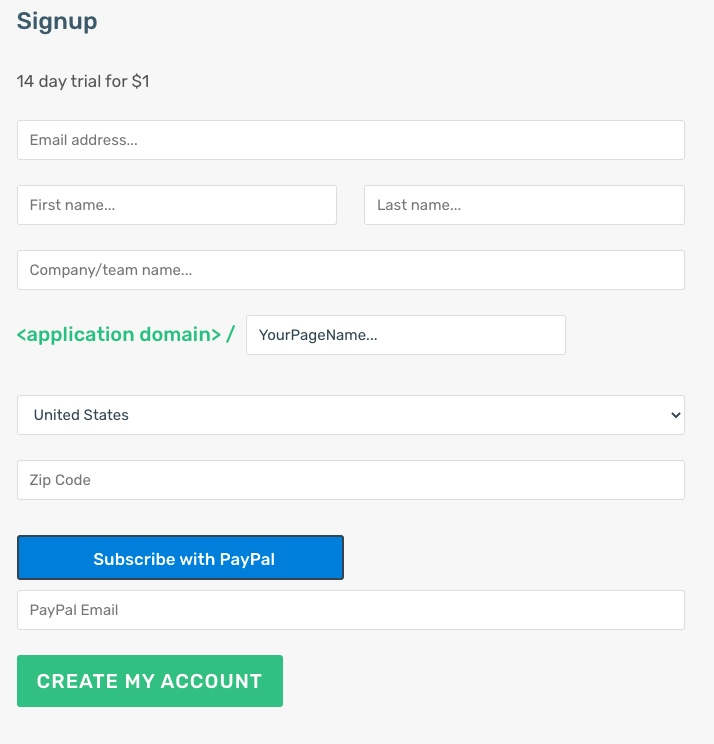

# Digital Rendevous

## Context

www.alt.bike is een speciaalzaak voor high end racefietsen. Ze willen graag klanten de mogelijkheid geven om online service of commerciële afspraak te maken.

DigitalRendevous biedt deze service aan aan handelszaken als alt.bike. Een button op alt.bike's website verwijst door naar alt.bike's pagina ((\<digitalrendevous domain\>/altbike)).

## Werkwijze

### 1. Aanmaken account op digitalrendevous.

De alt.bike's shopverantwoordelijke maakt een account aan op DigitalRendevous.

De service heeft een vaste kostprijs van €15 per maand. 

Hiervoor wordt bij het aanmelden een automatisch betaling opgezet bij PayPall (Paypal Subscription Button)

### 2. client profile.

alt.bike's shopverantwoordelijke gaat dan aan de slag het de altbike account in te stellen.

HIj geeft aan welke momenten beschikbaar zijn voor het maken van een reservatie.

### 3. Werkwijze

1. De klant die een afspraak wil maken klikt op de "appointment" button op alt.bike's website en word doorverwezen naar de alt.bike's pagina op \<digitalrendevous domain\>/altbike.

2. De klant krijgt de mogelijkheid om een afspraak te maken.

3. De klant en de shopverandwoordelijke krijgen beide een mailtje

4. De Shopverantwoordelijke heeft een overzicht van alle afspraken.

5. Tot 24u (of een instelbare tijdspanne) op voorhand kan de klant de afspraak aanpassen of annuleren.

